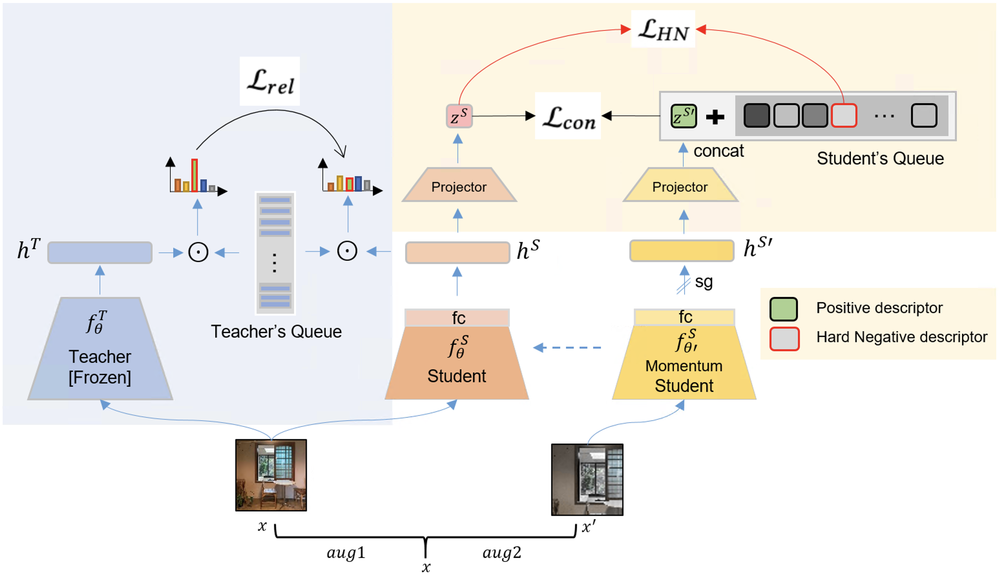

# Relational Self-supervised Distillation with Compact Descriptors for Image Copy Detection.
The official repository for Relational Self-supervised Distillation with Compact Descriptors for Image Copy Detection.

## Pipeline



## Implementation
- This code is implemented using Pytorch Lightning


## Datasets used
- DISC (Facebook Image Similarity Challenge 2021)
- NDEC (A Benchmark and Asymmetrical-Similarity Learning for Practical Image Copy
Detection 2023)
- CD10K(copydays + 10k distractors)

## Performances
<table style="margin: auto">
  <tr>
    <th>Method</th>
    <th>Network</th>
    <th># of<br />params[M]</th>
    <th>Feature Size</th>
    <th>µAPsn</th>
    <th>download</th>
  </tr>
  <tr>
    <td>DINO</td>
    <td align="right">ViT-B/16</td>
    <td align="right">85.8</td>
    <td align="right">1536</td>
    <td align="right">53.8</td>
  </tr>
  <tr>
    <td>SSCD</td>
    <td align="right">ResNet-50</td>
    <td align="right">24.6</td>
    <td align="right">512</td>
    <td align="right">72.5</td>
  </tr>
  <tr>
    <td>SSCD</td>
    <td align="right">EFF-B0</td>
    <td align="right">4.7</td>
    <td align="right">512</td>
    <td align="right">61.1</td>
  </tr>
  <tr>
    <td>RDCD(ours)</td>
    <td align="right">EFF-B0</td>
    <td align="right">4.7</td>
    <td align="right">64</td>
    <td align="right">53.5</td>
    <td><a href="https://drive.google.com/file/d/1k3G-xK4XxLlkrJAk_grYENNiKD6zSEBS/view?usp=drive_link">link</a></td>
  </tr>
  <tr>
    <td>RDCD(ours)</td>
    <td align="right">EFF-B0</td>
    <td align="right">4.7</td>
    <td align="right">128</td>
    <td align="right">61.1</td>
    <td><a href="https://drive.google.com/file/d/1u5T50kFOzaLlS-Q9stWLWw0E8WS7BYnO/view?usp=drive_link">link</a></td>
  </tr>
  <tr>
    <td>RDCD(ours)</td>
    <td align="right">Mobile-V3</td>
    <td align="right">4.9</td>
    <td align="right">256</td>
    <td align="right"><strong>65.6</strong></td>
  </tr>
  <tr>
    <td>RDCD(ours)</td>
    <td align="right">EFF-B0</td>
    <td align="right">4.7</td>
    <td align="right">256</td>
    <td align="right"> <strong>65.7</strong></td>
    <td><a href="https://drive.google.com/file/d/1LAWfP8d3_voxvmHrTRdCGIkN49fCAp-6/view?usp=drive_link">link</a></td>
  </tr>
  <tr>
    <td>RDCD(ours)</td>
    <td align="right">FastViT-T12</td>
    <td align="right">6.8</td>
    <td align="right">256</td>
    <td align="right"><strong>67.4</strong></td>
  </tr>
</table>

## Requirements

### Installation

```bash
pip install -r requirements.txt

```

## Teacher Models(Pretrained)
- SSCD: ResNet-50, ResNeXt101
- DINO: ViT-B/8

## Student Models
- EfficientNet-B0
- MobileNet-V3-Large
- FastViT-T12

## How to use

### docker install
```
docker build -t rdcd .
docker run --name rdcd -it --ipc=host --runtime=nvidia rdcd
```

### Library install
```
pip install -c pytorch faiss-gpu
pip install Pillow==9.5.0
```

### Training
```
sh train.sh
```

### Evaluation
```
sh disc_eval.sh
```

## Acknowledgement

Codebase from "[SSCD](https://github.com/facebookresearch/sscd-copy-detection)" , [pytorch-image-models](https://github.com/rwightman/pytorch-image-models)
